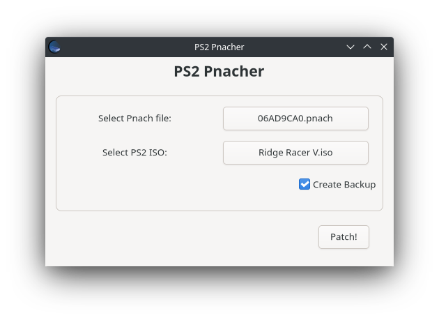

# PS2_Pnacher
Applying Pnaches directly to PS2 ISOs.
This program was written with the main goal to offer a Linux compatible counterpart to [PS2 Patch Engine](https://www.psx-place.com/threads/ps2-patch-engine-by-pelvicthrustman.19167/) (because that original Windows executable does not work under Wine so I thought heeey, i'll do my own).



## How it works
It's basically very straight forward. You select one pnach file. The program will try to parse that file smiliar to [PS2PatchELF](https://github.com/jpmac26/PS2PatchElf/blob/master/PS2PatchLib/PnachUtils.cs). You select one PS2 ISO and the program will call [libcdio](http://git.savannah.gnu.org/cgit/libcdio.git) to make sense of that file standard. The library will also try to locate me the needed ELF file to patch inside the ISO. When you press Patch, a backup will be made and the patches will be written into the file similar to how [PS2PatchELF](https://github.com/jpmac26/PS2PatchElf/blob/master/PS2PatchElf/Program.cs) did it.

## Building
To build you need to have the following packages installed (which I assume your distro already comes with):
- gtkmm-3.0
- glib-2.0
- libcdio++

Clone the repo and let cmake handle the rest. Make sure that glade file (res/com.snaggly.ps2pnach_gui.glade) it properly linked with your mainapp.cpp.

```
git clone https://github.com/Snaggly/PS2_Pnacher.git
cd PS2_Pnacher
cmake . -DCMAKE_BUILD_TYPE=Debug -DCMAKE_INSTALL_PREFIX=/usr
make
```

## Install
Installing is done similarly as in the building process. You only should change the build type to "Release" and let make install the rest on your OS.

```
cmake . -DCMAKE_BUILD_TYPE=Release -DCMAKE_INSTALL_PREFIX=/usr
sudo make install
```

## Whats next?
This is my first time trying to write something for Linux. If I did anything out of the norm I'd love to learn how it's done correctly! Or if they turn out of be issues I overlooked, please open a new issue (if not opened already).

Also I'd like to see this app being released as a Flatpak soon.
